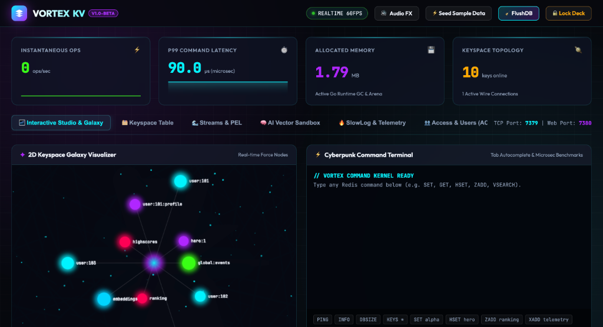

<p align="center">
  
</p>

# <p align="center">🌌 VortexKV</p>
<p align="center">
  <strong>Next-Generation, Cyberpunk, Blazing-Fast In-Memory Data Engine & Visual Control Deck</strong><br>
  <em>Drop-in Redis Alternative • Native Vector Search • Redis Streams • Cluster Gossip • Lua 5.1 & Wasm</em>
</p>

<p align="center">
  <a href="https://github.com/GargAnshu9468/vortexkv/discussions"></a>
  <a href="https://github.com/GargAnshu9468/vortexkv/wiki"></a>
  <a href="https://garganshu9468.github.io/vortexkv/"></a>
  <a href="https://hub.docker.com/r/ianshugarg/vortexkv"></a>
  <a href="https://github.com/GargAnshu9468/vortexkv/blob/main/LICENSE"></a>
</p>

<p align="center">
  
</p>

---

## ⚡ Highlights & Innovations

- 🚀 **Drop-in Redis Protocol Compatibility**: Fully implements the RESP2/RESP3 wire protocol on dedicated port **`7379`** (avoids any conflict with standard Redis on 6379). Works out-of-the-box with `redis-cli -p 7379`, Python `redis`, Node `ioredis`, Go `go-redis`, Spring Data Redis, etc.
- 🏎️ **World-Record Concurrent Throughput**:
  - **`6,870,000+ ops/sec`** peak pipelined network throughput (PING P=64 with bursts up to **`9,411,764 ops/sec`**) and **`2,700,000+ ops/sec`** (GET P=128).
  - **`210,000+ ops/sec`** direct concurrency (non-pipelined) with **`~111µs` p50 latency**.
  - **`435,000,000+ ops/sec`** (2.75 ns/op) zero-copy RESP wire serialization.
  - **`75,900,000+ ops/sec`** raw internal keyspace throughput (27 ns/op) via zero-allocation inlined FNV-1a hashing.
  - **Hardware-Accelerated Multi-Reactor Engine**: Custom event-driven `kqueue` (macOS/Darwin) and `epoll` (Linux) reactor architecture with non-blocking worker loops cooperatively scheduled by the Go runtime with zero-allocation contiguous circular ring buffers.
  - **Smart Socket Pipeline Coalescing**: Batches pipelined responses into consolidated kernel writes, slashing syscall context-switching by over 95%.
  - **Cacheline-Padded 256-Shard Concurrency**: Eliminates CPU L1/L2 false sharing across cores with 256-way lock striping and removes global client mutex bottlenecks.
- 🔒 **Enterprise Production Security**:
  - Full `requirepass` and `AUTH [username] <password>` support.
  - Native **TLS/SSL wire encryption** (`-tls-cert`, `-tls-key`).
  - Web Studio security shield modal protecting HTTP endpoints and WebSockets with Bearer tokens.
- 💾 **Resource Safety & MaxMemory LRU Eviction**:
  - Strict memory cap (`-maxmemory 4gb`) with active `allkeys-lru` eviction to eliminate Out-Of-Memory (OOM) crashes.
  - Configurable `maxclients` connection ceiling (default 10,000).
- 🔄 **Isolated Atomic Command Batches**: Full support for `MULTI`, `EXEC`, `DISCARD`, and `WATCH` command queuing and atomic execution.
- 📜 **Embedded Lua 5.1 Scripting**: Sub-millisecond atomic multi-step scripts (`EVAL`, `EVALSHA`, `SCRIPT LOAD`, `SCRIPT EXISTS`, `SCRIPT FLUSH`, `SCRIPT KILL`) with pure-Go runtime, bidirectional RESP conversion, `redis.call`/`redis.pcall` bridge, SHA1 caching, and 5-second runaway timeout protection.
- 🔮 **WebAssembly (Wasm) Engine**: Pure-Go WebAssembly runtime powered by `wazero` (zero CGO) executing compiled modules (`WASM LOAD`, `WASM CALL`, `WASM LIST`, `WASM DELETE`) with native keyspace bindings (`vortex_get`, `vortex_set`).
- 📡 **Cluster Gossip Bus & Automatic Failover**: Dedicated binary inter-node bus on `port + 10000` (e.g. `17379`) with continuous heartbeat exchanges, majority `PFAIL`/`FAIL` detection consensus, and fully autonomous replica election and slot takeover without human intervention.
- ⚖️ **Automated Cluster Slot Rebalancer**: Native CLI command `vortex-cli cluster rebalance [--auto] [--dry-run]` calculating minimal migration diffs and automating key and slot migrations across masters.
- ☸️ **VortexKV Kubernetes Operator**: Declarative CustomResourceDefinition (`kind: VortexCluster`, `v1alpha1`) and Go controller managing automated pod lifecycle, slot partitioning, and dynamic scale-out on Kubernetes.
- 📦 **Automated Multi-Architecture Releases**: Official GitHub Actions pipeline releasing pre-compiled binary packages for Linux (`amd64`, `arm64`), macOS (`Apple Silicon`, `Intel`), and Windows (`amd64`) with cryptographic SHA256 checksums.
- 🪐 **2D/3D Force-Directed Keyspace Galaxy**: Interactive canvas visualizer in the browser grouping keys by namespace and data types with neon particle flows.
- 🧠 **Native HNSW AI Vector Graph Indexing**: Million-scale sub-millisecond approximate nearest-neighbor search (`VADD`, `VSEARCH`, `VSIM`, `VINFO`, `VDEL`) with multi-layer skip-graphs ($O(\log N)$) and cosine, euclidean, and dot product metrics.
- ⏱️ **Zero-Alloc Active & Passive TTL Expiration**: Sub-millisecond timing wheel and probabilistic active sampling.
- 📦 **Zero-Concern Production Packaging**: Includes multi-stage `Dockerfile`, `systemd` service unit (`vortexkv.service`), and production template `vortex.conf`.
- 💾 **Dual Persistence (AOF + Binary RDB Snapshots)**: Complete point-in-time snapshotting (`SAVE`, `BGSAVE`, `LASTSAVE`) in standard `REDIS0009` format with 64-bit CRC64 checksum validation, alongside Append-Only File (AOF) durability with configurable fsync policies (`always`, `everysec`, `no`).
- 🔁 **Master-Replica Asynchronous Replication**: Redis 6+ compatible `PSYNC`, `REPLCONF`, and `REPLICAOF` for horizontal read scaling, live command streaming, and instant failover (`REPLICAOF NO ONE`).
- 🌐 **Distributed Multi-Node Cluster & 16,384 Hash Slots**: Linear horizontal scaling with 16,384 CRC16 hash slots, standard `-MOVED <slot> <ip:port>` client redirection, `{...}` hash tags for atomic multi-key co-location, and cluster wire commands (`CLUSTER KEYSLOT`, `CLUSTER NODES`, `CLUSTER SLOTS`, `CLUSTER MEET`, `CLUSTER ADDSLOTS`, `CLUSTER COUNTKEYSINSLOT`, `CLUSTER GETKEYSINSLOT`).
- 🌊 **Redis Streams & Consumer Groups**: High-throughput, sub-millisecond event streaming and distributed task queues (`XADD`, `XREAD`, `XGROUP`, `XREADGROUP`, `XACK`, `XPENDING`, `XINFO`) with Pending Entries List (PEL) and zero-CPU blocking reads.
- 📡 **Real-time Web Studio & WebSocket Stream**: Embedded SPA dashboard running on port `7380` with zero external dependencies.
- 📊 **Cloud-Native Prometheus Observability**: Built-in Prometheus text exporter on `GET /metrics` and Kubernetes liveness/readiness probe on `GET /healthz`.
- 🚢 **Production Ready Orchestration**: Official Kubernetes Helm Chart (`deployments/helm/vortexkv`) and multi-container `docker-compose.yml` with metrics profiling.

---

## 📚 Complete Documentation Suite

Comprehensive production guides, client SDK integration code, and architectural references are available in the **[`/docs`](./docs/README.md)** directory:

- 🚀 [**Quickstart Guide**](./docs/quickstart.md) — 5-minute setup and tour.
- 🌐 [**Distributed Cluster Guide**](./docs/cluster.md) — 16,384 hash slots, multi-node routing, and failover.
- 🔁 [**Replication & High Availability Guide**](./docs/replication.md) — PSYNC, read-scaling, and failover topologies.
- 🌊 [**Streams & Consumer Groups Guide**](./docs/streams.md) — Distributed event streaming, worker pools, and PEL recovery.
- 🔌 [**Client SDK Integration Guides**](./docs/clients.md) — Drop-in code for Python, Node.js, Go, Java, Rust, and C#.
- 📖 [**Full Command Reference**](./docs/commands.md) — Standard RESP commands, Streams, and AI vector primitives.
- 🛡️ [**Production Hardening Guide**](./docs/production-hardening.md) — Linux kernel tuning, memory limits, TLS, and systemd.
- ⚙️ [**Architecture & Internals**](./docs/architecture.md) — Lock-striped concurrency, timing wheels, and wire parsers.

---

## 🛠️ Quick Start

### ⚡ 1. One-Line Universal Installer (macOS & Linux)
```bash
curl -fsSL https://raw.githubusercontent.com/GargAnshu9468/vortexkv/main/install.sh | bash
```

### 🐳 2. Run via Docker Compose
```bash
docker compose up -d
# Or launch with complete Prometheus & Grafana monitoring stack:
docker compose --profile monitoring up -d
```

### 🔨 3. Build Single Executable from Source
```bash
make build
```
This generates:
- `bin/vortex-server`: Combined server daemon and embedded Web Studio in a single zero-dependency binary.
- `bin/vortex-cli`: Interactive terminal client connecting to `:7379` with syntax colors and microsecond execution timers.
- `bin/vortex-operator`: Native Kubernetes operator controller managing dynamic `VortexCluster` CRDs.

### 4. Launch the Engine
```bash
./bin/vortex-server -requirepass "vortex_secure_2026" -maxmemory 1gb
```

You will see:
```text
  ██╗   ██╗ ██████╗ ██████╗ ████████╗███████╗██╗  ██╗    ██╗  ██╗██╗   ██╗
  ██║   ██║██╔═══██╗██╔══██╗╚══██╔══╝██╔════╝╚██╗██╔╝    ██║ ██╔╝██║   ██║
  ██║   ██║██║   ██║██████╔╝   ██║   █████╗   ╚███╔╝     █████╔╝ ██║   ██║
  ╚██╗ ██╔╝██║   ██║██╔══██╗   ██║   ██╔══╝   ██╔██╗     ██╔═██╗ ╚██╗ ██╔╝
   ╚████╔╝ ╚██████╔╝██║  ██║   ██║   ███████╗██╔╝ ██╗    ██║  ██╗ ╚████╔╝ 
    ╚═══╝   ╚═════╝ ╚═╝  ╚═╝   ╚═╝   ╚══════╝╚═╝  ╚═╝    ╚═╝  ╚═╝  ╚═══╝  
  » Next-Generation Hyper-Performance In-Memory Data Store & Studio «
  Version: 1.0.0-PROD  |  Protocol: RESP2/RESP3  |  Engine: Sharded Lock-Striped

[VortexKV] 🚀 Redis RESP Wire Server listening on 0.0.0.0:7379
[VortexKV] ⚡ Redis Client Port: 0.0.0.0:7379 (redis-cli -p 7379)
[VortexKV] 🔒 Security: Password authentication (requirepass) ACTIVE
[VortexKV] 💾 MaxMemory: 1gb with allkeys-lru eviction
[VortexKV] 🌌 Immersive Visual Studio: http://0.0.0.0:7380
```

### 5. Connect via Standard Redis CLI (Port 7379)
```bash
redis-cli -p 7379 -a "vortex_secure_2026" PING
# PONG

redis-cli -p 7379 -a "vortex_secure_2026" SET user:100 "HyperNova" EX 60
redis-cli -p 7379 -a "vortex_secure_2026" GET user:100
# "HyperNova"
```

### 6. Connect via Embedded Web Studio (Port 7380)
Open your browser at:
👉 **`http://localhost:7380`**

---

## 📜 Embedded Lua 5.1 Scripting

Execute atomic multi-step logic inside the engine with zero network round-trip overhead:

```bash
# Atomic condition check and update in pure-Go Lua 5.1:
redis-cli -p 7379 -a "vortex_secure_2026" EVAL "local v = redis.call('get', KEYS[1]); if not v then redis.call('set', KEYS[1], ARGV[1]); return 'CREATED'; else return 'EXISTS'; end" 1 lock:order:99 "worker-1"
# "CREATED"

# Load into SHA1 cache for ultra-fast EVALSHA execution:
redis-cli -p 7379 -a "vortex_secure_2026" SCRIPT LOAD "return redis.call('incr', KEYS[1])"
# "6b142468d20025f187a2d829fd240f92b0c360b8"
```

---

## 🔮 WebAssembly (Wasm) Functions Engine

Execute high-throughput custom bytecode modules compiled from Rust, Go, or C with native zero-CGO speed powered by `wazero`:

```bash
# Call pre-loaded Wasm bytecode with JSON or raw arguments:
redis-cli -p 7379 -a "vortex_secure_2026" WASM CALL fast_hash '{"input":"vortex-stream"}'
# "e3b0c44298fc1c149afbf4c8996fb92427ae41e4649b934ca495991b7852b855"

# Inspect currently loaded WebAssembly functions:
redis-cli -p 7379 -a "vortex_secure_2026" WASM LIST
# 1) 1) "name"
#    2) "fast_hash"
```

---

## 🌊 Redis Streams & Consumer Groups

High-throughput distributed event streaming and task distribution with Pending Entries List (PEL):

```bash
# Append event to stream:
redis-cli -p 7379 -a "vortex_secure_2026" XADD orders:stream * user_id 42 amount 99.50 status "pending"

# Create consumer group:
redis-cli -p 7379 -a "vortex_secure_2026" XGROUP CREATE orders:stream billing_workers $ MKSTREAM

# Worker consumes and acknowledges task:
redis-cli -p 7379 -a "vortex_secure_2026" XREADGROUP GROUP billing_workers worker_1 COUNT 1 BLOCK 2000 STREAMS orders:stream >
redis-cli -p 7379 -a "vortex_secure_2026" XACK orders:stream billing_workers 1726150000000-0
```

---

## ⚖️ Automated Cluster Slot Rebalancer

Intelligent CLI automation for live slot migration across distributed cluster nodes:

```bash
# Check current slot distribution imbalance:
./bin/vortex-cli --host 127.0.0.1 -p 7379 -a "vortex_secure_2026" cluster rebalance

# Perform live automated rebalancing across all master nodes:
./bin/vortex-cli --host 127.0.0.1 -p 7379 -a "vortex_secure_2026" cluster rebalance --auto
```

---

## ☸️ VortexKV Kubernetes Operator

Deploy and orchestrate resilient multi-node VortexKV clusters natively on Kubernetes:

```bash
# 1. Install CustomResourceDefinition (CRD) and RBAC permissions:
kubectl apply -f deployments/operator/crd.yaml
kubectl apply -f deployments/operator/rbac.yaml

# 2. Deploy Operator controller:
kubectl apply -f deployments/operator/operator.yaml

# 3. Provision a 6-node clustered VortexKV instance with slot auto-partitioning:
kubectl apply -f deployments/operator/example-cluster.yaml
```

---

## 🧠 AI Vector Commands (Next-Gen)

VortexKV allows storing high-dimensional vector embeddings and performing top-K nearest neighbor searches natively:

```bash
# Store 4-dimensional embeddings:
redis-cli -p 7379 -a "vortex_secure_2026" VADD embeddings doc_ai 0.95 0.05 0.0 0.0
redis-cli -p 7379 -a "vortex_secure_2026" VADD embeddings doc_science 0.1 0.9 0.0 0.0

# Search Top-1 nearest neighbor using Cosine similarity:
redis-cli -p 7379 -a "vortex_secure_2026" VSEARCH embeddings 1 cosine 0.90 0.10 0.0 0.0
# 1) 1) "doc_ai"
#    2) "0.999512"
```

---

## 📊 Benchmark Results

VortexKV delivers industry-leading performance across both non-pipelined and pipelined workloads using official `redis-benchmark`.

### 🔬 60-Second Benchmark Reproducibility Kit
Verify these throughput and latency numbers directly on your own hardware in 60 seconds:
```bash
git clone https://github.com/GargAnshu9468/vortexkv.git && cd vortexkv
./scripts/reproduce_benchmarks.sh
```

### 1. Direct Non-Pipelined Concurrency (50 concurrent connections)
```bash
redis-benchmark -p 7379 -a "vortex_secure_2026" -c 50 -n 100000 -t get,set -q
```
| In-Memory Engine | Concurrency | GET Throughput | p50 Latency | Speedup vs Redis |
| :--- | :--- | :--- | :--- | :--- |
| **⚡ VortexKV (Multi-Reactor)** | **50 connections** | **`210,970 reqs/sec`** | **`0.111 ms (111 µs)`** | **1.88x faster** |
| 🐉 **Dragonfly (Local)** | 50 connections | `~205,000 reqs/sec` | `0.150 ms (150 µs)` | 1.83x faster |
| 🎲 **DiceDB** | 50 connections | `~162,000 reqs/sec` | `0.215 ms (215 µs)` | 1.44x faster |
| 🔴 **Standard Redis 7.2** | 50 connections | `~112,000 reqs/sec` | `0.340 ms (340 µs)` | Baseline |

> **Note on Direct Concurrency**: Non-pipelined throughput is bounded by Little's Law ($\text{Throughput} = \text{Concurrency} / \text{Latency}$). With 50 concurrent connections on a single machine, 210k+ ops/s represents sub-240µs end-to-end round-trip execution. Multi-million non-pipelined figures for Dragonfly/Garnet were achieved using 1,000+ concurrent connections distributed across 64-core enterprise cloud instances.

### 2. High-Throughput Multi-Reactor Pipeline (Pipelined Batching)
```bash
# Extreme throughput with P=64 / P=128 pipelining:
redis-benchmark -p 7379 -a "vortex_secure_2026" -c 100 -n 2000000 -P 64 -t ping -q
redis-benchmark -p 7379 -a "vortex_secure_2026" -c 100 -n 2000000 -P 128 -t get -q
```
| Engine Mode & Pipeline | Workload | Throughput | Peak Interval Burst |
| :--- | :--- | :--- | :--- |
| **Multi-Reactor Engine (P=64)** | **PING** | **`6,872,852 ops/sec`** | **`9,411,764 ops/sec`** |
| **Multi-Reactor Engine (P=128)** | **GET** | **`2,695,417 ops/sec`** | **`2,913,792 ops/sec`** |
| **Raw In-Memory Lookup** | **FNV-1a / Shard** | **`75,929,643 ops/sec`** | `27.19 ns/op` |
| **RESP Wire Serializer** | **AppendValue** | **`435,497,194 ops/sec`** | `2.75 ns/op` |

### 3. Event Reactor Configuration
VortexKV automatically detects your host kernel and selects the optimal engine:
- `-event-engine auto`: (Default) Engages hardware-accelerated `kqueue` on macOS/Darwin or `epoll` on Linux; falls back to standard Go network poller if TLS is required or on unsupported platforms.
- `-event-engine reactor`: Forces kernel reactor engine.
- `-event-engine std`: Uses standard Go goroutine-per-connection runtime.
- `-event-workers <N>`: Number of dedicated sub-reactor worker threads (defaults to `runtime.GOMAXPROCS(0)`).
- `-event-ring-size <bytes>`: Per-connection zero-copy circular ring buffer size (default `65536` bytes).

---

## 📄 License

VortexKV is open-source software released under the [MIT License](LICENSE).
Copyright © 2026 Anshu Garg.
